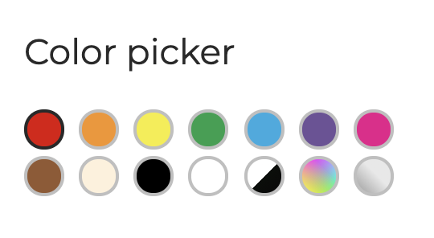

Color picker

Using radio buttons, create a color picker like the one in the picture below.

1. try to put each element in a row
1. each element should have a very light border
1. when an element is `checked`, the border should be dark
1. add another color for when the element is simply focused
1. it can be selected only one colour at a time

